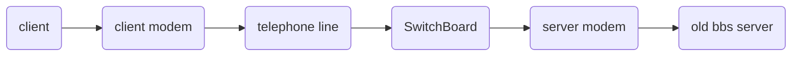
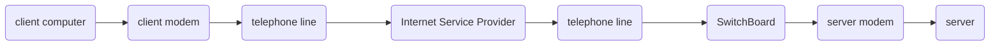
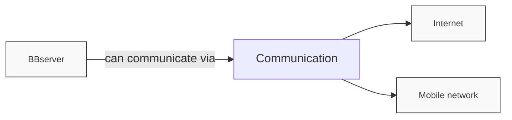
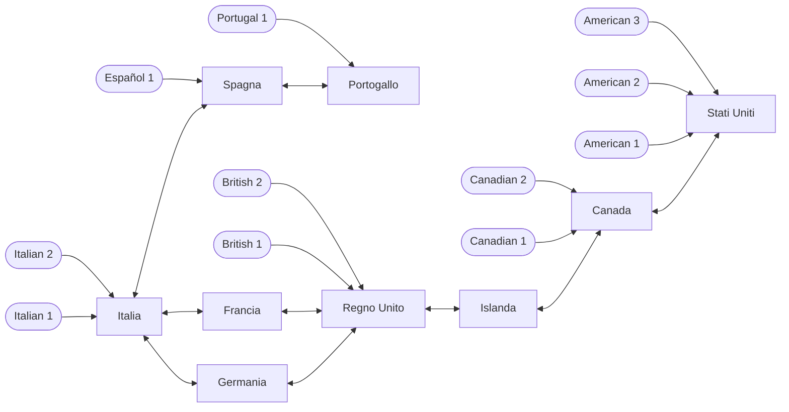
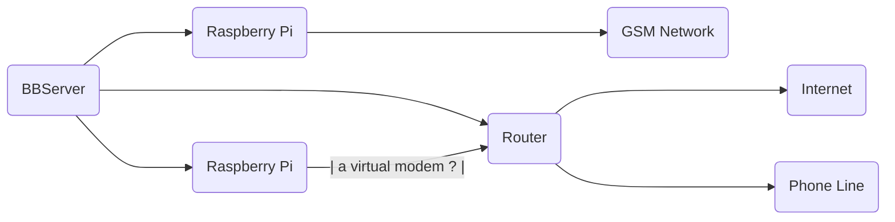
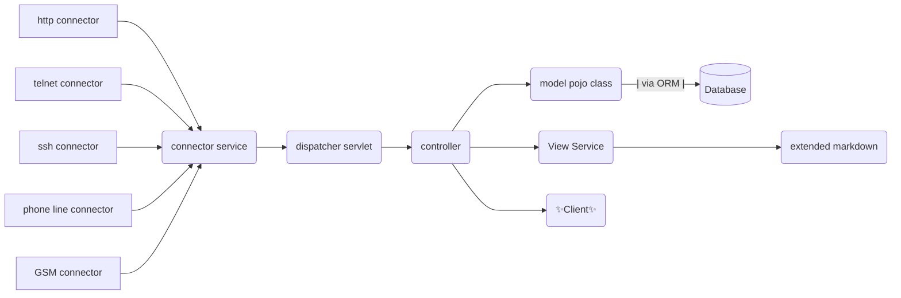

# BBServer

that' s just another BBS, maybe a little bit different.

## Core

What' s that?

I would like to create a node based BBS network, where each node is a server that can be connected to by other nodes.
Each node can have its own set of users, that can connect to other nodes.

what BBS used to be (in simple terms):

while older internet connections have a similar setup:

where once the modem was a "translator" of analog to digital signal.
In some cases (server side) there was even a telephone switchboard,
which allowed to receive multiple calls at the same time,
equivalent to multiple users at the same time.

the goal of being able to connect, without using the internet, falls on using a similar system.
obviously to have a portability of the system, I thought of relying on the GSM system,
that is, connecting to the server by actually calling the server itself, which can have a fixed or digital line.

## node network

first of all let's define a single node:

it would be ideal if different nodes communicate to eachother via internet,
but for the sake of compatibility (to actual BBS) it's possible to connect via phone line

obviusly it's flexible, so also clients can connect via internet

now an example of node network:

obviously the user cannot decide through which node, but it will be calculated using the distance of the single node, towards the closest node (it must be mapped to understand the right node), the fastest one, and the freest one

### how can people communicate thought different nodes?

First of all, it is good to specify how to identify node and client, therefore user and server:

in the previous diagram for the sake of simplicity I decided not to put multiple nodes (for example 2 Italian servers), but hopefully it will be just like that. each node must have a telephone number, not to allow the connection through the telephone line, but to give an effective identity to the administrator.

this data will obviously not be visible to the user, but only to the sysops, and to the server software itself. and it will be the identifier of the single node: `country code + phone number` (for example 0039_0123456789). The same identifier also applies to users, who however will still be tracked through their username.

like the old BBS a user will have an internal email and through that it will be possible to interact with another user, in order to preserve personal data.

here's an example:
what other users see:
`<username@server_domain.country>` which translates to `devcat2001@BBServer.it`, but for the server this will be translated as `0039_1234567890@0039_0123456789.0039`. maximum uniqueness!

so here is how the connection will happen:

let's describe the use cases:

1. a server is added to the list
2. a user wants to register on a server
3. the user of a server wants to contact the user of another server

In the first case, at the end of the configuration the server on behalf of the sysop will contact another already known server (inserted by the sysop during the configuration phase), to communicate the creation of the new server, the existing server will assign a score to the new server, which can go up or down based on the reliability and popularity of the server itself.

in the second case, when a user wants to register on a server, he can do it independently, but verification will be necessary both via email and via SMS (automated), and also in this case the user will have a score determined in the same way as the server.

finally the juicy part,
`User1@Italia.it` wants to send an email to `User1@UnitedKindom.uk`

obviously there is quite a bit of distance, so in case there is someone in the middle, it would be preferable to go through him, also in order to have an extra backup in case of a connection failure:

according to the previous scheme, the Italian user must go through France or Germany, this passage will happen automatically based on the parameters defined previously. in case the UK server does not respond, the score will be lowered, and the closest server will be contacted which will take care of maintaining the message waiting for a positive outcome. For the sake of transparency, the user will be aware of the status of the message, therefore in which server/s this message will be kept.

NB: popularity means how many times the server is contacted, in case of a response the score will increase, in case the server is offline, the score will be lowered

## features

Obviously, as it is open source software, it will be easily expandable and modifiable by anyone.

Here are the services listed:

1. Mail (obviously), an intra server and extra server email service. comparable to a registered letter with return receipt, and the courier shipment of a package, therefore a certain visibility of what is happening and the status (if displayed or not)
2. Live Chat: direct messaging service, with public and/or private groups, and obviously private or group chats, a timeless classic, but with ephemeral messages by default!
3. Data (valid for public services such as forums, imgboards, public groups, etc.), public data will be archived, and will be directly accessible via id, or via categories.
4. Mailing List: like usenet to be clear
5. Forum: like reddit, divided into threads, megathreads, and subthreads,
6. Weather: a classic of bbs
7. Games (tailor made): divided into single player and multiplayer, games exclusively for bbs :D
8. img board: like 4chan
9. News: news also on BBS! so you can get even more depressed :D
obviously we're joking, but the news will be divided by category and there will also be updates to the software itself
10. Diary: a platform for blogging

## Hardware & software architecture

### Hardware

Obviously we could avoid using a simple raspberry? And where would the fun be, right?

Let's go back to the past functioning of BBS and the first internet connections: both used the telephone line, now as far as I know, at least in Italy, if you have the right offer you can call for free, all you need is a SIM card, as for the good old landline, I don't think it's necessary to call, but only receive calls.

So for simplicity I'll limit myself to describing the simplest possible node, literally the minimum requirements:

First of all you need some real hardware, even a raspberry pi is fine, as long as it can run the software, I think I'll write it in java, but I also like python a lot! it would be preferable to connect this raspberry to a storage, possibly large enough to contain the data part, I don't think it needs much, given the current size of the project, but who knows in the future.. :D

obviously an internet connection, to communicate with the other nodes, you don't need to use the telephone line, both for the speed that leaves something to be desired, but at least to keep a bit of free line.

and the ugly and absolutely WIP part (ok, so is the project that currently does not exist, but this is to be defined even now that we are in the design and analysis phase). I don't think it is possible to connect the telephone cable (assuming that the old RJ-45 still exists) directly to the server, so you need something that talks to it, on the hardware side I imagine an arduino, on the software side I imagine a raspberry (the server uses the GPIO ports of the raspberry to communicate with the arduino). in the past, telephone switchboards were used, to allow multiple users of a BBS to connect at the same time, it would be preferable to find one.

it would also be preferable to have a second raspberry that communicates with the GPIO ports to an arduino, which this time communicates with a SIM card, (maybe a GSM module), so as not to use the landline that anyway.. I don't think it's still provided by TIM haha.

my mistake, I need to find out more :)
I'll make up for it with a little drawing :D

this drawing will surely be wrong, but it needs to be corrected because we're in WIP zone!😎

### Software

a couple of key concepts for those not used to web dev

- Controllers usually intercept a http request
- out of habit I put the dispatcher servlet intercepts the request and sends it to the correct controller, I think it's a good thing, also inserting an auth guard there for example, for authentication
- services are called by controllers and have the business logic
- for data management, I think it's better to use an ORM (like JPA), so you can swap the db easily.
- for the view, I would say that the ideal would be to create a separate project, like in pwa, with their own architecture.

for the sake of lightness, I think it is necessary to make the server itself handle the "heavy" part of the work, and make sure that the "frontend" comes out with "documents" as light as possible. using caching, you can lighten the graphic part by downloading it only once, like CDN, so this kind of extended markdown, which will come out of it will have a header with the data needed to process the document, frontend side (for example the graphic part), while in the document since there will be media, they will be treated possibly as vectors, and where not possible there will be external links, which will be downloaded at a later time (this stuff must go through a wav file, it seems normal to save where possible!).

when the user loads a document, for example a blog post, this will be loaded in the maximum possible format (extended md, high quality media), then in the backend they will be downscaled. images and videos will have their counterpart in lower qualities, while the text can be converted into a basic text without the graphic additions of markdown (maybe saving the tables), or with a minimum of ascii art that we all love :)

Usually there are many more controllers, models, etc, but I didn't know how to add multiple using mermaid, sorry 🥲

#### ✨Client✨

in reality it would be preferable to have asynchronous communication,
compared to the synchronous communication offered by the current dear old BBS,
it is not necessary to pass the data directly as if it were a socket,
but rather a more relaxed management of the network through
sessions and hooks, so as to be able to easily manage even
multiple connections at the same time
